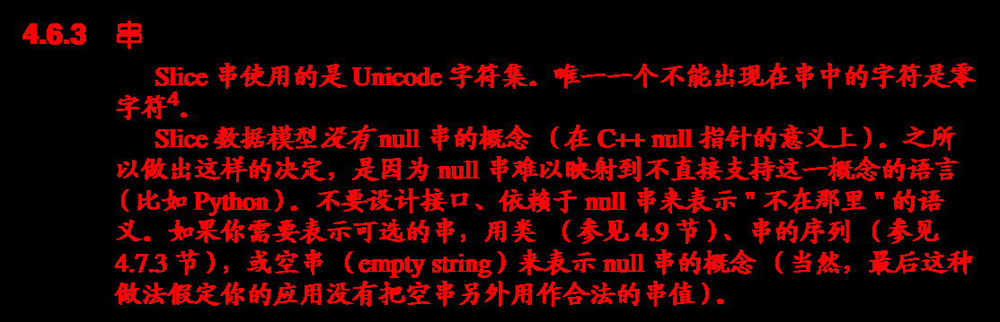
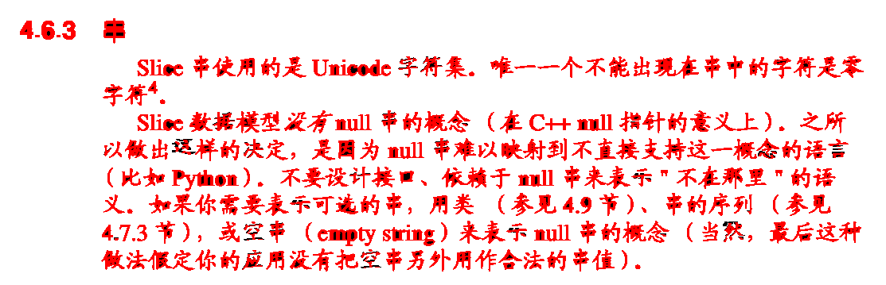

# Imaginer

 Construct the world with imagination, image......, imagination......

## about the value name

    PIXPOS's  value name as pixel
    PIXPOT's  value name as ppot
    PIXPOT8's value name as pots8

## some example show here

TO

TO

TO

TO

### This a  gif for show a image that after several iterative processing

TO

### This sample show a character 'W', draw use [fonts.ifs file](./doc/fonts/fonts.ifs)

### This sample show Chinese words, draw use [words.ifs file](./doc/fonts/words.ifs)

- NOTE:  [fonts.ifs](./doc/fonts/fonts.ifs) record some ascii code character, [chinese.ifs](./doc/fonts/chinese.ifs) 
record 2994 chinese words; [words.ifs](./doc/fonts/words.ifs) is sum of [chinese.ifs](./doc/fonts/chinese.ifs)  and [fonts.ifs](./doc/fonts/fonts.ifs) ,

## This is first Code refactoring for Imaginer

### Here

## Android

 Yon Can like this to get a shared libraries; and use in Android JNI, You must install NDK before
 - cd jni
 - ndk-build
