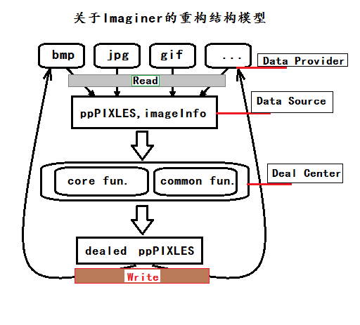

# Imaginer
 Construct the world with imagination, image......, imagination......
## about the value name
    PIXPOS's  value name as pixel
    PIXPOT's  value name as ppot
    PIXPOT8's value name as pots8
## This is first Code refactoring for Imaginer
### Here

 NOTE:
The next push code will be the first version that is substantially complete in functionality
