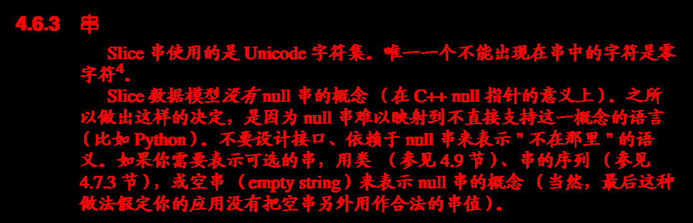
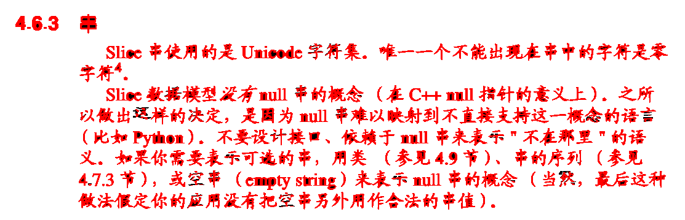

# Imaginer

 Construct the world with imagination, image......, imagination......

## about the value name

    PIXPOS's  value name as pixel
    PIXPOT's  value name as ppot
    PIXPOT8's value name as pots8

## some example show here

TO

TO

TO

TO

### This a  gif for show a image that after several iterative processing

TO

## This is first Code refactoring for Imaginer

### Here

## Android

 Yon Can like this to get a shared libraries; and use in Android JNI, You must install NDK before
 - cd jni
 - ndk-build
