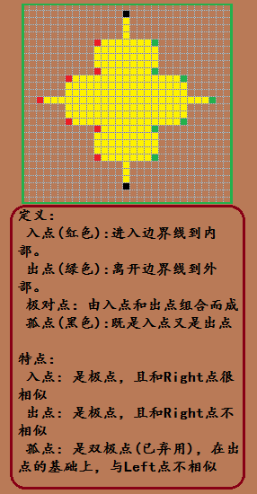

# 前言

    极点对：详见图Edge.png(如上图)
    作用：用来对一个边界线内部的部分进行行定位，从而将边界内部不外部的边界点确定下来，用于扣取边界的内部数据
    说明：对于极点对的分布，边界线的每一行变化中列的左右极限点，故极点对最少有边界线包含的区域中最大行数组极点对，当然，对于有褶皱的，则会更多

## 先前的获取方法说明

    该方法是相对于整个图片来说的极点对集合，已经是在遍历图片的过程中（一般是一次边界获取结束），获取行数据，再对已经处理过每一行的像素位置判断，对满足调节的进行判断是极点对的哪个部分（入点、出点或孤点），该方法的缺点是：
    1.所有的极点对是相对于整个图像的而不是相对于边界线的，这个严重缺乏独立性
    2.获取极点对的算法较复杂而且精度不够，对于复杂的情况，特殊处理较多

## 新的方法探索

    该方法的思想是每一组极点对对应于每一边界线，扩大了其独立性，加强了边界线与极点对集合的关系，为后续处理提供极大的便利，此外，该算法充分利用了每一次边界线的遍历过程，所以避免重复遍历边界是非常重要的前期过程

### 方法主要思想和操作：

    1.获取起点(startPoint)信息
    2.从两个方向(顺时针getLpoint()和逆时针getRpoint())交叉切换的获取边界线
        切换条件:获取的下一个点的y左边发送变化,及切换到另一个方向，所以注意对切换前的现场的保护
    3.每当y发生变化将建立一个新的监测行-用来保留处于改行的所有极点值
    4.重复2-3步，知道两个方向的下一个点相遇，停止循环
    5.由上面的获取的二维表(行：保存着整个边界线即内部区域的上下最大范围，列：每一个值保留的是改行中的所有极点的值)，遍历处理每一行，两两组合，即可以得到改行的所有极点对

#### 关于该方法的几个细节的说明：

    1.排序的必要性讨论
        * 由于边界线都处于起点的下方，在不管是顺时针或逆时针的情况下都是试图在向下遍历获取边界，即使是向上也不会超过起点的所在行，否者该轨迹必然在某个时刻等于起点所在行，那么循环已经终止或改轨迹无效
        * 在遍历轨迹的时候y在变化，但每一个新的y都将建立一个监测行（一个向量存储），对于已经在历史中的监测行，只需要找到相应的行即可
        * 对于监测行的每一列（值），都是存储该行与轨迹的极限位置（极点），所以顺时针获取的极点必然是在摸索的过程中尽量向右走，（不妨以向右为x的正方向）则x则单调增大或不变,直到顺时针的右向左走的趋势，此时y也随之变小，同理，
            而逆时针的必然是在摸索的过程中斤两向左走，则想单调减小或不变，直到逆时针的右向右走的趋势，此时y也随之变大；当顺变小，你变大时，必然在某个时候相遇，而最终停止
     综上：对于排序的必要性结果是：“必要”，而且，由于每次加入一个数据是在前一个基础上假如，而前一个状态中数据集是有序的，则新加的数据加入后必须保证还是有序，所以本质上不必排序，只要保证插入的方法恰当即可
    2.遍历轨迹结束的判断
        * 一个方向在该方向遍历的过程与另一个停止的方向相遇
        * 一个方向到达图片边缘，另一个也到边缘（必然有先后到达，先到达的在另一个未到达之前将不再切换到另一个，所以要设置一个标志防止切换时的再次循环，不妨设置为rEdge和lEdge）
    3.极点对的生成算法(如下图)

        * 由监测行中的数据是单调的，所以只需要，只需要两两组合即可得到
        * 如图情形二，中箭头标记的位置，对于这种特殊情况，由于边界线获取的过程中或记录两次，所以这个坐标将在监测行中有两份且必然相邻，所以处理方法同上
    4.误区
        * 对于上下方向的切换的过程中，获取边界的函数只在改点走一次，即只会记录一次，但相对于图中的情形二的箭头位置最下面的那个点，数据只保留一份，这个是最容易忽略的位置