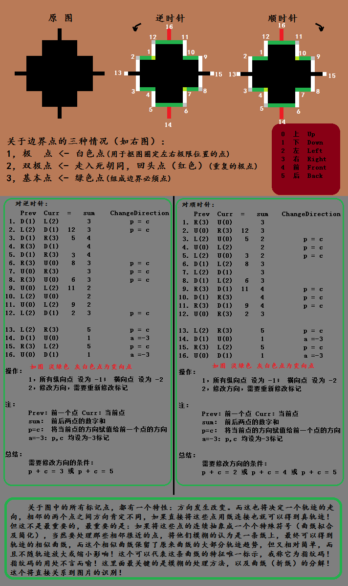

#参考图片

逆时针：

Point |Prev  |Curr  |equal |sum     |ChangeDirection
:----:|:----:|:----:|:----:|:------:|:---------------:
 1    |D(1)  |L(2)  |      |3       |p = c
 2    |L(2)  |D(1)  |12    |3       |p = c
 3    |D(1)  |R(3)  |5     |4       |
 4    |R(3)  |D(1)  |      |4       |
 5    |D(1)  |R(3)  |3     |4       |
 6    |R(3)  |U(0)  |8     |3       |p = c
 7    |U(0)  |R(3)  |      |3       |p = c
 8    |R(3)  |U(0)  |6     |3       |p = c
 9    |U(0)  |L(2)  |11    |2       |
10    |L(2)  |U(0)  |      |2       |
11    |U(0)  |L(2)  |9     |2       |
12    |L(2)  |D(1)  |2     |3       |p = c
13    |L(2)  |R(3)  |      |5       |p = c
14    |D(1)  |U(0)  |      |1       |a =-3
15    |R(3)  |L(2)  |      |5       |p = c
16    |U(0)  |D(1)  |      |1       |a =-3

操作：

    1.所有纵向点 设为 -1； 横向点 设为 -2
    2.修改方向，需要重新修改标记

注：

	Prev：前一个点 Curr：当前点
	sum： 前后两点的数字和
	p=c： 将当前点的方向赋值给前一个点的方向
	a=-3: p,c 均设为-3标记 

总结：

	需要修改方向的条件：
	p + c = 3 或 p + c = 5
	
	
	
顺时针：

Point |Prev  |Curr  |equal |sum     |ChangeDirection
:----:|:----:|:----:|:----:|:------:|:---------------:
 1    |R(3)  |U(0)  |      |3       |
 2    |U(0)  |R(3)  |12    |3       |
 3    |L(2)  |U(0)  |5     |2       |p = c
 4    |U(0)  |L(2)  |      |2       |p = c
 5    |L(2)  |U(0)  |3     |2       |p = c
 6    |D(1)  |L(2)  |8     |3       |
 7    |L(2)  |D(1)  |      |3       |
 8    |D(1)  |L(2)  |6     |3       |  
 9    |R(3)  |D(1)  |11    |4       |p = c
10    |D(1)  |R(3)  |      |4       |p = c
11    |R(3)  |D(1)  |9     |4       |p = c
12    |U(0)  |R(3)  |2     |3       |  
13    |L(2)  |R(3)  |      |5       |p = c
14    |D(1)  |U(0)  |      |1       |a =-3
15    |R(3)  |L(2)  |      |5       |p = c
16    |U(0)  |D(1)  |      |1       |a =-3

操作：

	1，所有纵向点 设为 -1； 横向点 设为 -2
	2，修改方向，需要重新修改标记

注：

	Prev：前一个点 Curr：当前点
	sum： 前后两点的数字和
	p=c： 将当前点的方向赋值给前一个点的方向
	a=-3: p,c 均设为-3标记 

总结：

	需要修改方向的条件：
	p + c = 2 或 p + c = 4 或 p + c = 5

**额外：**

>关于图中的所有标记点，都有一个特性：方向发生改变。而这也将
决定一个轨迹的走向，相邻的两个点之间方向肯定不同，如果直接将这
些点用线连接也就可以得到真轨迹！但这不是最重要的，最重要的是：
**如果将这些点的连续抽象成一个个特殊符号（曲线拟合及简化），当然
要处理那些相邻很近的点，将他们模糊的认为是一条线上，最终可以得
到轨迹的相似曲线，而这个相似曲线保留了原来曲线的大部分轨迹趋势，
但又相对简单，而且不随轨迹放大或缩小影响！这个可以代表这条曲线
的特征唯一标示，我称它为指纹码！指纹码的用处不言而喻！这里面最
关键的是模糊的处理方法，以及曲线（折线）的分解!**

**这个将直接关系到图片的识别**

