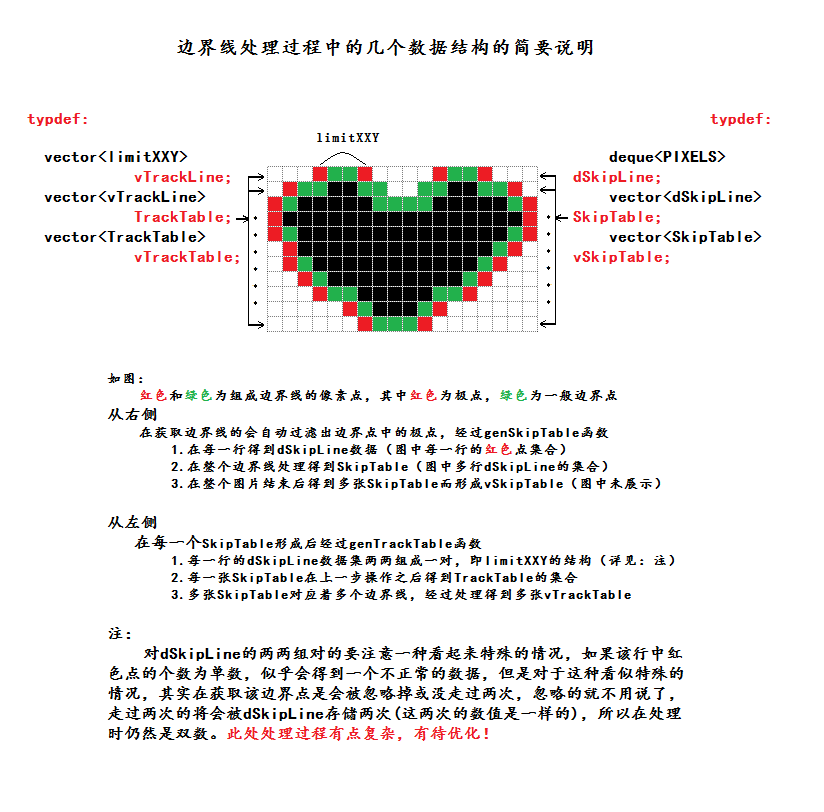



# 如图：

红色和绿色为组成边界线的像素点，其中红色为极点，绿色为一般边界点

## 从右侧

在获取边界线的会自动过滤出边界点中的极点，经过genSkipTable函数

        1.在每一行得到dSkipLine数据（图中每一行的红色点集合）
        2.在整个边界线处理得到SkipTable（图中多行dSkipLine的集合）
        3.在整个图片结束后得到多张SkipTable而形成vSkipTable（图中未展示）

## 从左侧

在每一个SkipTable形成后经过genTrackTable函数

        1.每一行的dSkipLine数据集两两组成一对，即limitXXY的结构（详见：注）
        2.每一张SkipTable在上一步操作之后得到TrackTable的集合
        3.多张SkipTable对应着多个边界线，经过处理得到多张vTrackTable

注：
    对dSkipLine的两两组对的要注意一种看起来特殊的情况，如果该行中红色点的个数为单数，
    似乎会得到一个不正常的数据，但是对于这种看似特殊的情况，其实在获取该边界点是会被
    忽略掉或没走过两次，忽略的就不用说了，走过两次的将会被dSkipLine存储两次(这两次的
    数值是一样的)，所以在处理时仍然是双数！

## 此处处理过程有点复杂，有待优化